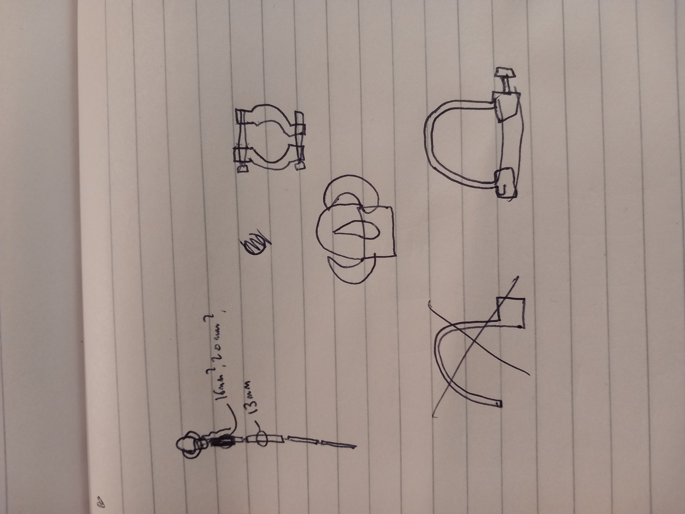
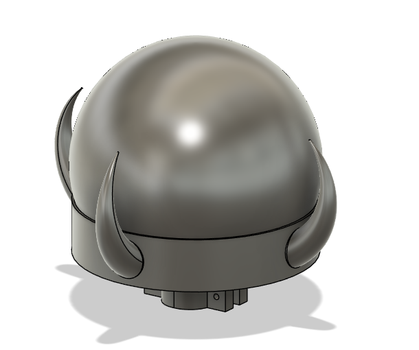
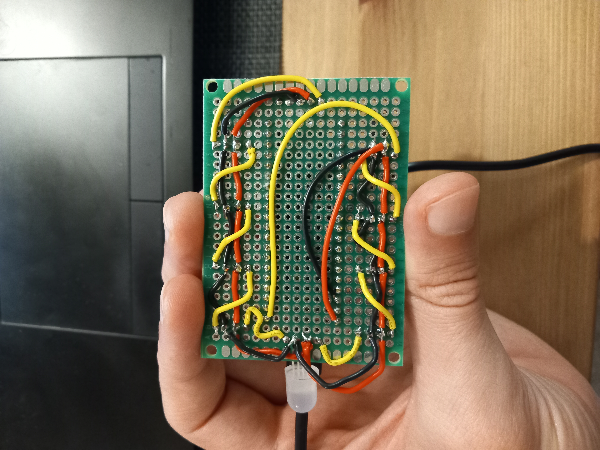
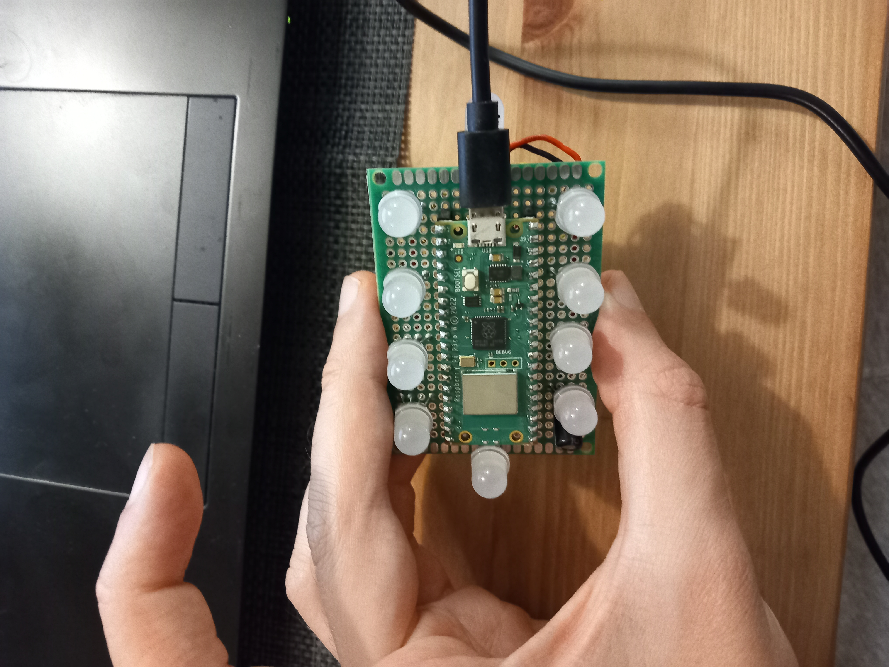

# crystal_ball
A fun electronics project to make a witch's staff!

# 3d-Model
This is what the initial sketch was, and the 3d-model:  
  

# hardware
I used parts that I had lying around, namely some Adafruit through-hole Neopixels and a Pi Pico W. It wasn't pretty but worked.  
  
  

