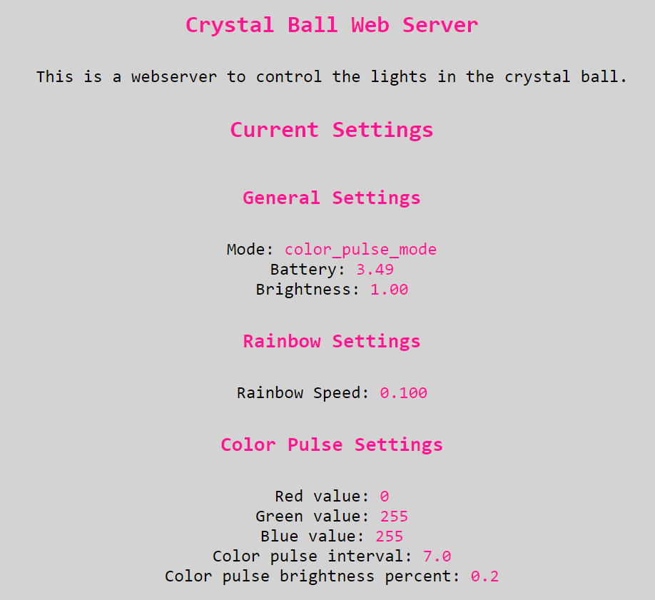

# crystal_ball
A fun electronics project to make a witch's staff that mounts to a cane. I made the initial version in 2 (pretty frantic) days before a music festival. Then I took a couple weeks after to polish a version 2!

  
  

# The Design
I knew I wanted to mount to the cane using brackets that clamped to the cane. I pictured a witch or wizard's staff with a colourful orb of changing colours on top of the staff. From here, I made some initial sketches.  
  

My first version looked like the below, but this had some trouble mounting to the cane because the mounts were too close to the crystal ball.  
  

After a lot of 3d-modelling and many failed prints, I ended up with the below:
  

Some of my considerations in the design were how to structure the dome. I wanted it to be super thin, ideally one nozzle perimeter of 0.4mm, so that light would get through. But, such a thin part is very tricky to print, especially because I wanted the top to be pretty flat meaning supports would typically be used. You can see how many failed dome iterations I had before I got some working below. I ended up printing it at 0.05mm layer height, with extra perimeters if needed and extra perimeter on overhands enabled in prusa-slicer.  

You can see a .gif of me the finished 3d-model being created step by step thanks to a cool feature in fusion 360.
  

The 3d-models can be found in the assets 3d-models subfolder.  

# hardware
I was pretty proud that for version 1, I used parts that I had lying around, namely some Adafruit through-hole Neopixels and a Pi Pico W. It wasn't pretty but it worked.  
  
  

This version didn't have a battery, so a cable went out through the bottom of the orb and to a portable USB power bank inside of a pocket. While dancing it became evident this was a terrible idea, and we needed a battery inside of the orb. The cable would get snagged, pull out, and just generally made me nervous.

To integrate a battery, I used an Adafruit feather specifically the ESP32 v2 feather. I used a 2000mAh Lipo. The feather made it easy to manage the battery, and I was already using circuit python so the feather had support for that and porting the software to the new hardware was easy. I was able to re-use the perf-board that I had made the neopixel circuit on.  

# code
I used Adafruit's circuit python, neopixel, and http_server libraries. I knew that I wanted various light animations and to be able to control the brightness and light modes while out and about. When dancing in a dark tent, full brightness is annoying to others around us, hence the need to control brightness. To accomplish this, I had the microcontroller broadcast a WLAN network in AP mode and hosted a webserver that served a webapp to control everything.  

The web app looked like this:  

For the software, Adafruit's learning ecosystem (like  [this](https://learn.adafruit.com/pico-w-http-server-with-circuitpython/create-your-settings-toml-file)) and circuit python's documentation made it a lovely first experience with that stack. More code details are in the code subfolder and source code is there as well.  

# assembly

This project had a lot of moving pieces, from design to hardware to software. Integrating it all into a final product was non-trivial but I was proud of the end-result.

Version 1 didn't have a battery, but was still cool. I didn't get a complete dome printed in time due to the issues I mentioned earlier, so I ended up welding a plastic disc to the top of a dome that had failed printing. Most of the pieces fit together with captive nuts and M2 mechanical screws. A picture is below and you can see a video demo [here](https://youtube.com/shorts/bqeQ5W-EpfM) and [here](https://youtube.com/shorts/Z6r9HBsY354).

Version 2 fixed some design issues with version 1 and introduced a battery, plus some more software features. It's not perfect--for example mounting it to and from the cane requires finessing some M2 screws and hex nuts that have a tendency to jump out of the hand and hide forever under the couch--but it is something I am proud of. You can see a picture below and a video [here](https://youtube.com/shorts/kJiOJtX-Ke8).
